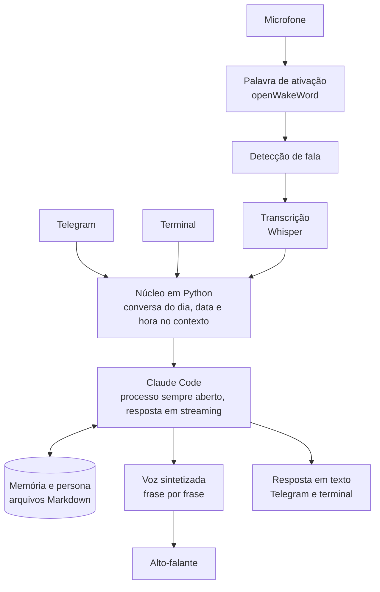

# JARVIS

Assistente pessoal sempre ligado, com voz, memória e personalidade próprias. Um núcleo em Python conecta o Claude a canais de conversa (voz no ambiente, Telegram, terminal) e mantém a memória em arquivos de texto que o próprio assistente lê e atualiza.

> **Este repositório é uma vitrine.** Ele descreve a arquitetura e o andamento do projeto. O código-fonte fica em um repositório privado, porque o projeto roda na minha casa e carrega configurações e dados pessoais.

## O que ele faz hoje

- **Conversa por voz**: detecta a palavra "Jarvis" pelo som, transcreve a fala e responde falando, frase por frase, sem esperar a resposta inteira.
- **Conversa por texto**: Telegram e terminal, com a mesma conversa do dia em todos os canais.
- **Memória persistente**: perfil e notas em Markdown, fora da pasta do código, atualizados pelo próprio assistente.
- **Personalidade definida em arquivo**: um texto de sistema diz quem ele é e como fala.
- **Pareamento seguro no Telegram**: só o dono conversa com o bot, confirmado por um código que aparece apenas no computador.

## Arquitetura

| Módulo | Papel |
|---|---|
| Cérebro | Mantém o Claude Code aberto e recebe a resposta aos poucos |
| Conversa | A conversa do dia, igual em todos os canais |
| Ouvido | Microfone, detecção de fala e transcrição com Whisper |
| Chamado | Reconhece o som da palavra de ativação |
| Voz | Transforma a resposta em fala, frase por frase |
| Canais | Voz, Telegram e terminal |
| Casa | Prepara a pasta de memória e guarda o estado |

## Decisões técnicas

- **Processo do modelo sempre aberto.** Abrir o Claude Code a cada mensagem levava de 6 a 8 s por resposta. Com o processo persistente e entrada e saída em `stream-json`, a primeira palavra sai em cerca de 1 s em respostas simples e em 2 a 3 s quando ele consulta a memória.
- **Palavra de ativação pelo som, não pela transcrição.** O Whisper errava a palavra "Jarvis" com frequência. Um detector dedicado (openWakeWord) resolve o chamado antes de qualquer transcrição, e nada é enviado para fora antes disso.
- **Fala em streaming.** A voz começa a falar na primeira frase pronta. Do fim da pergunta ao começo da fala: de 2,2 a 3,5 s.
- **Memória em Markdown.** Transparente e editável: dá para abrir, ler e corrigir o que o assistente sabe.
- **Polling no Telegram.** É o núcleo que pergunta por mensagens novas, então nenhuma porta precisa ser aberta na rede de casa.
- **Sem execução de comandos por mensagem.** Uma mensagem de texto nunca vira comando no computador sem regras claras de autonomia.

## Stack

| Camada | Tecnologia |
|---|---|
| Núcleo | Python |
| Modelo | Claude, via Claude Code |
| Transcrição | faster-whisper |
| Palavra de ativação | openWakeWord |
| Voz | Síntese por API, com provedor configurável |
| Canal de texto | Telegram Bot API |

## Andamento

- [x] Núcleo com personalidade e memória
- [x] Resposta rápida com processo persistente
- [x] Voz do assistente em streaming
- [x] Ouvido: microfone, detecção de fala, Whisper e palavra de ativação
- [ ] Painel (HUD) na tela
- [ ] Servidor dedicado rodando 24 horas
- [ ] Controle do ambiente via Home Assistant
- [ ] Gatilhos e heartbeat: agir sozinho por horário e por evento
- [ ] Agenda e e-mail
- [ ] Visão por câmera

## Autor

**Luiz Eduardo Wiegert** · [LinkedIn](https://www.linkedin.com/in/luizwiegert) · [GitHub](https://github.com/Luizwiegert)
